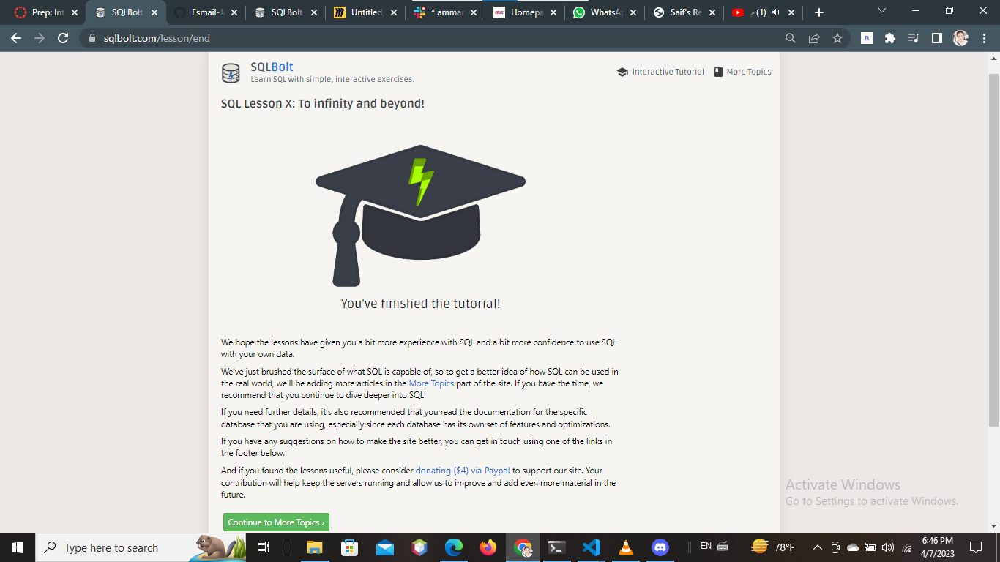

# Introduction To SQL 

## SQL 
SQL (Structured Query Language) is a programming language designed for managing and manipulating relational databases. It is used for creating, updating, querying, and deleting data in databases. SQL is based on a set of commands and statements that are used to interact with a database, including SELECT, INSERT, UPDATE, DELETE, and JOIN. SQL is a standard language that is supported by most relational database management systems (RDBMS), including MySQL, Oracle, Microsoft SQL Server, and PostgreSQL.

### 1- SELECT

SELECT is a SQL statement used to retrieve data from a database table. The SELECT statement allows you to specify the columns that you want to retrieve from the table, as well as any filtering or sorting criteria that you want to apply to the data.

The basic syntax of the SELECT statement is as follows:

SELECT column1, column2, ...
FROM table_name
WHERE condition;

### 2-INSERT

INSERT is a SQL statement used to add new rows of data to a table in a database. The INSERT statement allows you to specify the table and columns you want to add data to, as well as the values you want to insert.

The basic syntax of the INSERT statement is as follows:

INSERT INTO table_name (column1, column2, ...)
VALUES (value1, value2, ...);

### 3-DELETE

DELETE is a SQL statement used to remove one or more rows of data from a table in a database. The DELETE statement allows you to specify the table you want to delete data from, as well as the conditions that must be met for a row to be deleted.

The basic syntax of the DELETE statement is as follows:

DELETE FROM table_name
WHERE condition;

### UPDATE

UPDATE is a SQL statement used to modify one or more rows of data in a table in a database. The UPDATE statement allows you to specify the table you want to update, the columns you want to modify, and the new values you want to set for those columns.

The basic syntax of the UPDATE statement is as follows:

UPDATE table_name
SET column1 = value1, column2 = value2, ...
WHERE condition;

## Mid-level SQL
Mid-level SQL skills include knowledge of advanced concepts such as joins, subqueries, aggregate functions, window functions, indexes, stored procedures, transactions, and views. By mastering these concepts, you can become a more proficient SQL developer and handle more complex database management tasks.

## Mid Level SQL Practice Grounds
Some online resources for practicing mid-level SQL skills include LeetCode, HackerRank, SQLZoo, Codecademy, W3Schools, DB-Fiddle, and SQL Fiddle. These platforms offer a range of exercises and problems that cover advanced SQL concepts like joins, subqueries, and aggregate functions, among others. Practicing on these platforms can help improve your SQL skills and build your confidence in handling complex database management tasks.

## PostgreSQL 

PostgreSQL is a powerful open-source relational database management system (RDBMS) that is used to store, manage and retrieve data. It is known for its reliability, scalability, and robustness, and is commonly used for large-scale applications and data-intensive workloads. PostgreSQL supports various data types, including numeric, string, date/time, and array, and also includes advanced features such as support for JSON and XML data, indexing, replication, and full-text search. Additionally, PostgreSQL is highly customizable, allowing developers to extend its functionality through user-defined functions, stored procedures, and triggers. It is also compatible with various programming languages, including Java, Python, PHP, and Ruby, making it a popular choice for many software development projects.

